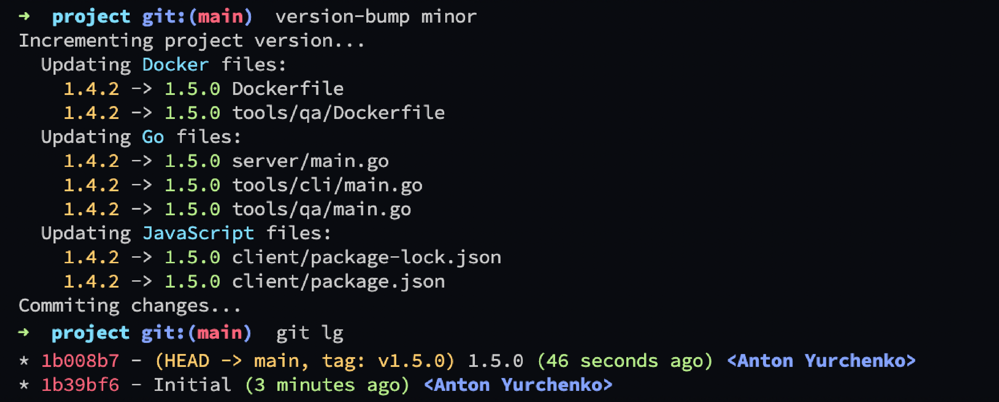

# version-bump

[](https://github.com/anton-yurchenko/version-bump/releases/latest)
[](https://codecov.io/gh/anton-yurchenko/version-bump)
[](https://goreportcard.com/report/github.com/anton-yurchenko/version-bump)
[](https://github.com/anton-yurchenko/version-bump/actions/workflows/release.yml)
[](LICENSE.md)

Have you ever made a mistake incrementing a project version?  
Do you have multiple files to update the version at?  
I was always forgetting to update a `Dockerfile` label or a version constant in `main.go` file. Inspired by `npm bump`, I wrote **version-bump**.  

This application allows easily incrementing a multi-language project [Semantic Version](https://semver.org/), committing the changes and tagging a commit.



## Features

- Supported languages: **Go**, **Docker**, **JavaScript**
- [Semantic Versioning](https://semver.org/) Compliant
- Update files in multiple directories of the project at once
- Commit and tag changes

## Installation

Download [latest release](https://github.com/anton-yurchenko/version-bump/releases/latest) and move the file to one of the directories under your `PATH` environmental variable.

## Configuration

**version-bump** has two modes of operation: automatic / manual.
In automatic mode, **version-bump** will try to identify versions of all supported languages in a root of the project (wherever executed).
In a manual mode, **version-bump** will read a configuration file and modify files according to it. It is expected be executed in a root of the project where the configuration file is.

Some languages, have a constant value in a specific file that contains a version, which are fairly easy to increment. 
But some languages are leaving that decision to a developer, thus **version-bump** assumes a constant position/value for them as well.

| Language      | Expected Values                               | Filename                              |
|:-------------:|:---------------------------------------------:|:-------------------------------------:|
| Docker        | `Version`/`version` label                     | `Dockerfile`                          |
| Go            | String constant named `Version`/`version`     | `*.go`                                |
| JavaScript    | JSON `version` field                          | `package.json`, `package-lock.json`   |

### Automatic

Run **version-bump** in a root of the project: `version-bump <major/minor/patch>`

### Manual

1. Create a configuration `.bump` file in a root of the project.
2. Add project languages and their configuration in a form of:

    ```
    [ <language-name> ]
    Enabled = true/false
    Directories = [ <path>, <path>, ... ]
    ```

    - `Enabled` - default `false`
    - `Directories` - default `['.']`

3. Run **version-bump** in a root of the project: `version-bump <major/minor/patch>`

*Configuration Example:*

```toml
[Docker]
Enabled = true
Directories = [ '.', 'tools/qa' ]

[Go]
Enabled = true
Directories = [ 'server', 'tools/cli', 'tools/qa' ]

[JavaScript]
Enabled = true
Directories = [ 'client' ]
```

## Remarks

- Versions are expected to be consistent across all files
- In automatic mode, **version-bump** has all languages enabled

## License

[MIT](LICENSE.md) © 2021-present Anton Yurchenko
